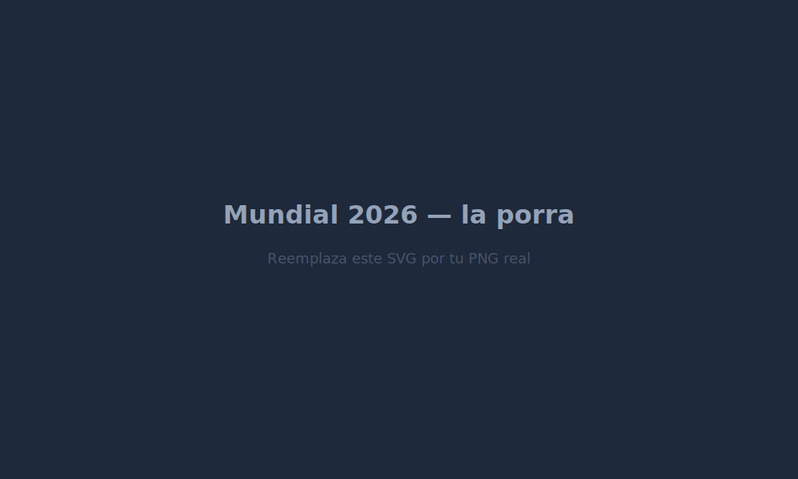
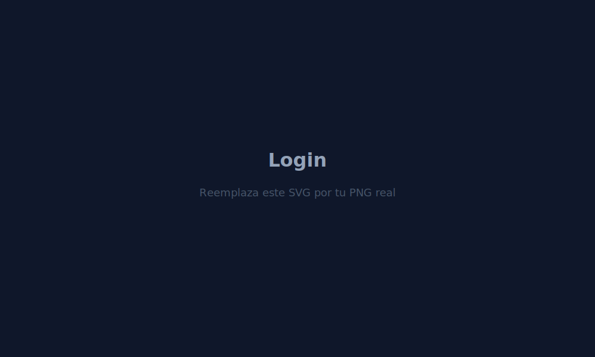
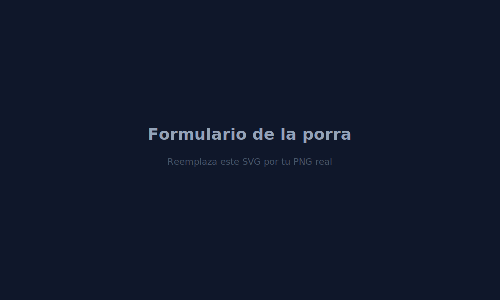
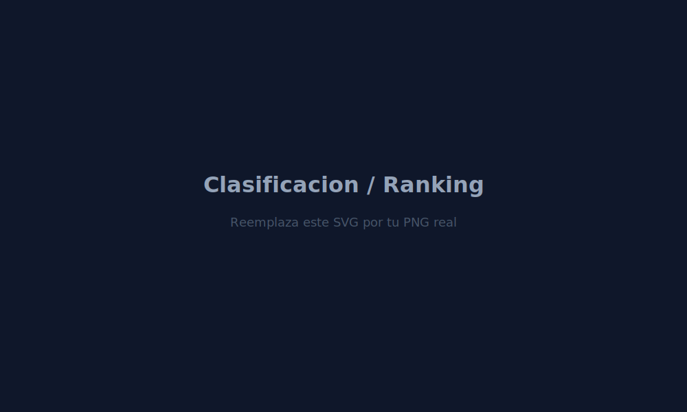
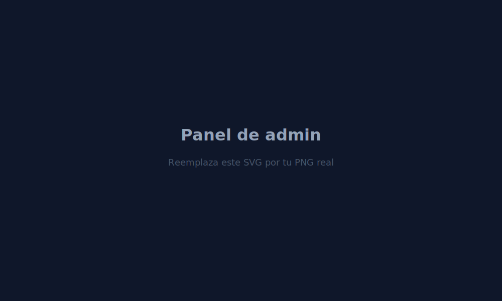
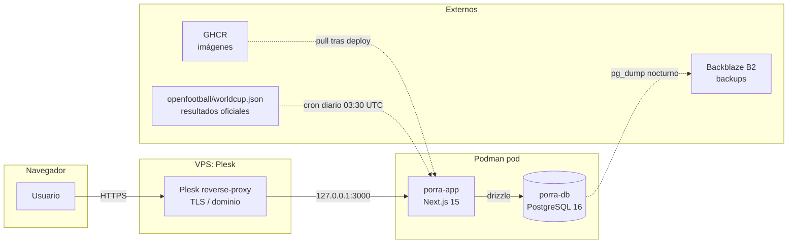

# Porra Mundial 2026

> App web para gestionar una porra del Mundial 2026 entre un grupo cerrado de amigos. Acceso por invitación, predicciones bloqueadas al pitido inicial, puntos y ranking automáticos.

<p align="center">
  
</p>

<p align="center">
  <a href="#"></a>
  <a href="#"></a>
  <a href="#"></a>
  <a href="#"></a>
  <a href="#"></a>
  <a href="#"></a>
  <a href="#"></a>
  <a href="#"></a>
</p>

---

## ¿Qué es esto?

Una aplicación web para que un grupo cerrado de **hasta 15 amigos** se juegue una porra del Mundial 2026 sin necesidad de Excels, hojas compartidas ni reglamentos manuales:

- Cada jugador **rellena su porra** (104 partidos + clasificaciones + premios) antes del pitido inicial.
- El admin **introduce los resultados oficiales**, automatizable con el [importer desde openfootball](docs/results-importer.md).
- El **motor de puntuación** computa los puntos siguiendo el [reglamento canónico](docs/scoring-rules.md) (regla del Excel del organizador) y actualiza el ranking al instante.
- **Bracket rígido**: las predicciones del cuadro no se recolocan (ADR 0003). Si te equivocas en un cruce, lo arrastras hasta la final.

---

## Capturas

| | |
|:---:|:---:|
| **Login** | **Formulario de la porra** |
|  |  |
| **Clasificación** | **Panel admin** |
|  |  |

> Las capturas son placeholders SVG. Sustitúyelas por PNG reales en `docs/screenshots/` (mismo nombre, extensión `.png`) y actualiza las extensiones en este README.

---

## Stack

| Capa | Elección |
|---|---|
| Runtime | Node.js 20 LTS |
| Framework | Next.js 15 (App Router, Server Actions) |
| Lenguaje | TypeScript estricto (`strict: true`, prohibido `any`) |
| Estilos | Tailwind CSS + `shadcn/ui` |
| Base de datos | PostgreSQL 16 |
| ORM / migraciones | Drizzle + `drizzle-kit` |
| Validación | Zod (todo input externo) |
| Auth | Propia: cookie httpOnly + tabla `sessions` + bcrypt (cost 12) |
| Tests unitarios | Vitest (374+ tests) |
| Tests e2e | Playwright |
| Containerización | Podman + podman-compose |
| Reverse proxy | Plesk (TLS automático en el host) |
| CI/CD | GitHub Actions → GHCR → SSH deploy |

Decisión de cada pieza en los [ADRs](docs/decisions/).

---

## Arquitectura



---

## Desarrollo local

```bash
# 1. Levantar Postgres en local (la app va con npm run dev)
cd infra && podman-compose up -d db

# 2. Migraciones y seed (48 equipos + 104 partidos)
npm run db:migrate
npm run db:seed

# 3. Admin inicial (una vez)
npm run admin:bootstrap

# 4. Arrancar la app
npm run dev
```

Guía completa en [`docs/getting-started.md`](./docs/getting-started.md).

### Scripts disponibles

```bash
npm run dev                # Next.js dev server
npm run build              # build de producción
npm run test               # Vitest (374+ tests)
npm run typecheck          # tsc --noEmit
npm run e2e                # Playwright (Mundial bloqueado)
npm run e2e:locked         # Playwright (porra ya bloqueada)
npm run db:migrate         # aplica migraciones Drizzle
npm run db:seed            # equipos + partidos del Mundial
npm run admin:bootstrap    # crea admin inicial desde .env
npm run scores:recalc-all  # recálculo total + auditoría
npm run results:import     # importer desde openfootball (dry-run por defecto; añade --apply)
```

---

## Sistema de puntuación

**Acumulativo por partido** (regla del Excel canónico, ADR 0009/0010/0012):

| Categoría | Puntos por acierto | Máximo |
|---|---|---:|
| Marcador exacto de partido (signo + exacto) | 3 + 5 = **8** | 576 (grupos) + 256 (knockouts) |
| Signo 1X2 acertado sin marcador exacto | **3** | — |
| Posición de grupo (1.ª / 2.ª / 3.ª / 4.ª) | 2 / 2 / 2 / 2 | 96 (12 grupos × 8) |
| Equipo clasificado a fase X | **2** por equipo | 128 (a lo largo de las 6 fases) |
| Campeón / Subcampeón / 3.º puesto | 30 / 20 / 10 | 60 |
| Bota Oro / Plata / Bronce | 10 / 7 / 5 | 22 |
| Balón Oro / Plata / Bronce | 10 / 7 / 5 | 22 |
| **TOTAL** | | **1 160** |

Reglamento completo y casos límite en [`docs/scoring-rules.md`](docs/scoring-rules.md).

---

## Decisiones arquitectónicas (ADRs)

| # | Decisión |
|---|---|
| [0001](docs/decisions/0001-stack-tecnico.md) | Stack: Next + Drizzle + Postgres + Podman |
| [0002](docs/decisions/0002-auth-propia-sin-libreria.md) | Auth propia sin Auth.js / Lucia |
| [0003](docs/decisions/0003-bracket-rigido-sin-rebracket.md) | Bracket rígido (no se recoloca) |
| [0004](docs/decisions/0004-mejores-terceros-tabla-no-derivable.md) | Mejores terceros: tabla, no derivable |
| [0005](docs/decisions/0005-podio-sugerido-no-persistido.md) | Podio sugerido pero no persistido |
| [0006](docs/decisions/0006-puntuacion-grupos-basada-en-outcome.md) | Puntuación de grupos basada en outcome |
| [0007](docs/decisions/0007-desempate-grupos-gd-gf.md) | Desempate de grupos: GD → GF |
| [0008](docs/decisions/0008-deploy-vps-detras-de-plesk.md) | Deploy detrás de Plesk |
| [0009](docs/decisions/0009-puntuacion-segun-excel-canonico.md) | Puntuación según Excel canónico |
| [0010](docs/decisions/0010-correccion-posiciones-grupos-3-4.md) | Corrección posiciones 3.º/4.º a 2 pts |
| [0011](docs/decisions/0011-importer-openfootball.md) | Importer automático desde openfootball |
| [0012](docs/decisions/0012-correccion-puntos-marcador-exacto.md) | Marcador exacto = 8 (3 signo + 5 exacto) |

---

## Estructura del repositorio

```
app/                   # Next.js App Router (login, porra, clasificación, admin)
components/            # UI (shadcn) + componentes del dominio
lib/
  db/                  # schema, migraciones, seed, importer Excel
  scoring/             # motor de puntos puro + tests
  results-importer/    # importer automático openfootball + tests
  validators/          # esquemas Zod compartidos
  auth/                # session, password hashing, invitations
docs/
  decisions/           # ADRs
  scoring-rules.md     # reglamento canónico (fuente única para el motor)
  data-model.md        # esquema de BD
infra/
  Containerfile        # imagen de la app
  compose.yaml         # db + app
  scripts/             # deploy, backup, importers
tests/e2e/             # Playwright
```

Detalle completo y convenciones en [`CLAUDE.md`](./CLAUDE.md).

---

## Despliegue

CI/CD vía GitHub Actions:

1. Push a `main` → tests + build de imagen → push a `ghcr.io/<owner>/porra-app:<sha>`.
2. Deploy automático por SSH al VPS → `./infra/scripts/deploy.sh <sha>` (pull imagen, migrate, up, health check con rollback automático).
3. Cron diario en el VPS importa resultados oficiales desde openfootball (ver [`docs/results-importer.md`](docs/results-importer.md)).

Diagrama y detalles en [`docs/getting-started.md`](docs/getting-started.md) §Deploy.

---

## Estado

Proyecto **personal** para un grupo cerrado de amigos. No acepta colaboradores externos. Las invitaciones las genera el admin desde `/admin/invitaciones`.

---

## Licencia

Sin licencia pública — uso interno del autor y su grupo de amigos. Si quieres usarlo de inspiración para tu propia porra, fork bienvenido; PRs no.
